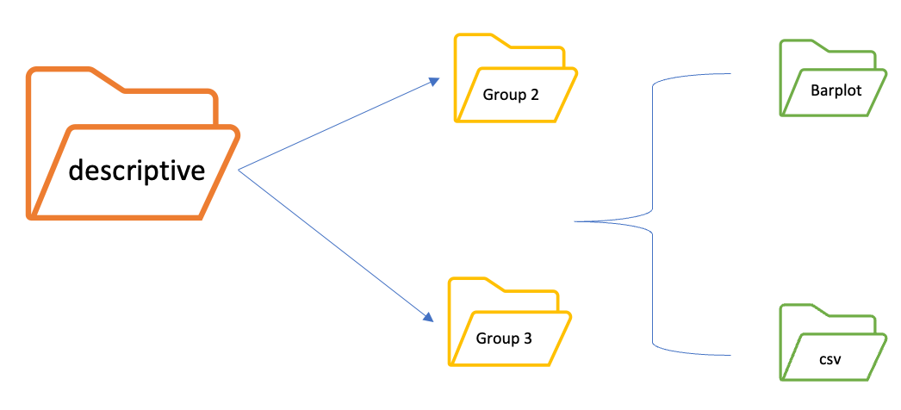
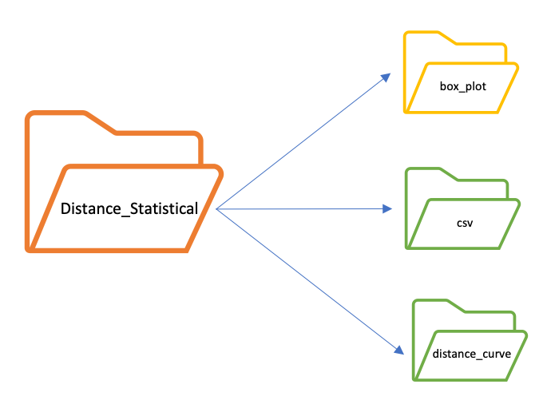

# ALOA (Analysis spatiaL prOfiling imAging)

## Introduction

ALOA is a useful bioinformatics tool designed to transform raw data from PhenoCycler®-Fusion and inFormTM analysis ([Unlock the Power of Spatial Biology with phenoptrReports](https://www.akoyabio.com/wp-content/uploads/2022/01/Spatial-Biology-with-phentoprReports-TechNote.pdf)) into publication-ready results, thus advancing the accessibility and utility of spatial tissue analysis in cancer research.


## Features
- Spatial **Data** Analysis 📈

    This section provides an overall slide analysis and consists of several steps outlined below.

    The first step is the merge of cell seg data files of each roi. These files are merged into a single file for each patient. Cells that don't have any of the phenotypes of interest (OTHER) are removed. <br>

    The results are saved into:<br>
    - <em><output_folder>/Merged_clean</em><br>


    Starting from  *Merged_clean* files it is possible to proceed for 5 different sections:
    - **Map Plot**: this section produces images to visualize spatial distribution of markers of interest

    - **Description**: this section produces **bar plots**, through which visualize markers row and normalized count for each patient, and **box plots** through which compare markers count from groups. <br> For the count there is the possibility to calculate: <br>

    - **Distance**: this section integrates [find_nearest_distance](https://akoyabio.github.io/phenoptr/articles/computing_distances.html) phenoptr script and calculate the distance between couples of markers.<br> Distances can be compared between groups and visualize through box plot (default) and distribution curve plot (optional)

    - **Clustering**: this section evaluate different clustering algorithm on data. Markers distribution across clusters can be seen and analyze through boxplot and reports

    - **CrossPCF**: this section integrates [crossPCF](https://github.com/JABull1066/ExtendedCorrelationFunctions) script from Bull et al, 2024 and calculate the cross-PCF between couples of markers. <br> A statistical analysis can be conducted if two or more groups are specified.

- Spatial **Imaging** Analysis <br>

    This section provides a data visualization feature that produce static and interactive images from a selected number of ROIs. 

    Firstly ROIs' cell seg data are cleaned from cells that don't have any of the phenotypes of interest (OTHER).

    Subsequently, 3 different options can be selected:
 
    - **Image Match**: This section provides a spatial plot of phenotypes' position on ROI's composite image.
    
    - **Distance Match**: This section provides a spatial plot of phenotypes' distances on ROI's composite image for all possible combination of couples of the selected phenotypes.
    
    - **Cross-PCF Image Match**: This section provides a termic plot of Cross-PCF on ROI's composite image for all possible combination of couples of the selected phenotypes.


## Installation


1. Open a terminal
2. Digit the following command to clone the repository folder:
```
git clone https://github.com/bioinformatics-policlinicogemelli/ALOA
```
3.  Install all of the packages required
```
cd <ALOA_folder_path>/ALOA

pip install -r requirements.txt

Rscript installation_rpackages.R req.txt
```

#### Docker

3. Build docker file
```
cd <ALOA_folder_path>/ALOA
docker build -t aloa .
```
4. Run docker in interactive mode
```
docker run -it -v <data_input_path>:./<data_input_folder_name> -v <output_data>:./output -v ./<path_to_config.json>:/config.json aloa
```

⚠️ *data_input_folder* inside json file and the mounted input folder must be the same. *i.e.* if data_input_folder="./data_input", the docker run command will be:
  ```
docker run -it -v <data_input_path>:./data_input -v <output_data>:./output -v ./<path_to_config.json>:/config.json aloa
```

## Usage
The first step to start using ALOA is to correctly set the configuration file *config.json*. This file is divided in 10 subsessions:
<br>
* **Paths**: here is possible to specify *data_input_folder*, *output_folder* and *sample_sheet* paths

* **Phenotypes**: here are specified the markers of interest into *pheno_list*

* **Descriptive**: here is possibile to specify parameters, for descriptive section, as *raw* and/or *normalized* count

* **Map_plot**: here are specified parameters as *multi_plot*, if you can... and *pheno_list* where specified the markers on performing the analysis

* **Distance**: here are specified the parameters for distance calculation as *save_csv* if you want to save the distance values, *save_img* uf you want to... and *pheno_list* if you want to calculate distance between specific markers

* **image_match**: here is possibile to specify a sublist of markers to print on composite images (if not specified the complete list of phenotypes will be considered). It is also possible to create interactive images, in addition to the static ones, by set the interactive option to true. Interactive graphs' layout can also be customize with the options layout_marker_edge_col and layout_marker_size to change respectively the edge color and the size of dots plotted on image and layout_xsize layout_ysize to customize the size of the image.

* **distance_match**: here is possibile to specify a sublist of markers whose distances are to be printed on composite images (if not specified the complete list of phenotypes will be considered).

* **statistical_distance**: here is possibile to specify the markers for which you can perform the distance statsical analysis in *pheno_from* and *pheno_to*

* **cluster**: here is possibile to specify the parameters for clustering analysis as *pheno_list* if you want to specify specific markers, *k* if you want to specify the number of clusters, *cluster_method* to choose the clustering method (spectral or kmeans)

#INSERIRE WORFLOW
### 1. Merge Cell Seg Data
In this section the cell_seg_data.txt files, for each patient, are merged into a single file.
The single cell_seg_data are in patient specific folder into data_test/raw_data.
```
data_test
├── img_match
│   ├── Set12_20-6plex_S_[14146,53503]_composite_image.jpg
│   ├── Set12_20-6plex_S_[15491,58698]_composite_image.jpg
│   ├── Set12_20-6plex_S_[17241,54367]_composite_image.jpg
│   ├── Set4_1-6plex_T_[11472,51360]_composite_image.jpg
│   ├── Set4_1-6plex_T_[15206,60541]_composite_image.jpg
│   ├── Set4_1-6plex_T_[16142,55840]_composite_image.jpg
│   ├── Set8_11-6plex_S_[14996,59221]_composite_image.jpg
│   ├── Set8_11-6plex_S_[17130,56449]_composite_image.jpg
│   └── Set8_11-6plex_T_[13394,50883]_composite_image.jpg
│
├── raw_data
│   ├── Set12_20-6plex_S
│   │   ├── Merge_cell_seg_data.txt
│   │   ├── Set12_20-6plex_S_[14146,53503]_cell_seg_data.txt
│   │   ├── Set12_20-6plex_S_[15491,58698]_cell_seg_data.txt
│   │   └── Set12_20-6plex_S_[17241,54367]_cell_seg_data.txt
│   ├── Set12_20-6plex_T
│   │   ├── Merge_cell_seg_data.txt
│   │   ├── Set12_20-6plex_T_[14146,53503]_cell_seg_data.txt
│   │   ├── Set12_20-6plex_T_[15491,58698]_cell_seg_data.txt
│   │   └── Set12_20-6plex_T_[17241,54367]_cell_seg_data.txt
│   ├── Set4_1-6plex_S
│   │   ├── Merge_cell_seg_data.txt
│   │   ├── Set4_1-6plex_S_[11472,51360]_cell_seg_data.txt
│   │   ├── Set4_1-6plex_S_[15206,60541]_cell_seg_data.txt
│   │   └── Set4_1-6plex_S_[16142,55840]_cell_seg_data.txt
│   ├── Set4_1-6plex_T
│   │   ├── Merge_cell_seg_data.txt
│   │   ├── Set4_1-6plex_T_[11472,51360]_cell_seg_data.txt
│   │   ├── Set4_1-6plex_T_[15206,60541]_cell_seg_data.txt
│   │   └── Set4_1-6plex_T_[16142,55840]_cell_seg_data.txt
│   ├── Set8_11-6plex_S
│   │   ├── Merge_cell_seg_data.txt
│   │   ├── Set8_11-6plex_S_[13394,50883]_cell_seg_data.txt
│   │   ├── Set8_11-6plex_S_[14996,59221]_cell_seg_data.txt
│   │   └── Set8_11-6plex_S_[17130,56449]_cell_seg_data.txt
│   └── Set8_11-6plex_T
│       ├── Merge_cell_seg_data.txt
│       ├── Set8_11-6plex_T_[13394,50883]_cell_seg_data.txt
│       ├── Set8_11-6plex_T_[14996,59221]_cell_seg_data.txt
│       └── Set8_11-6plex_T_[17130,56449]_cell_seg_data.txt
│
├── cellType_dict.tsv
└── sample_sheet.tsv

```
All ALOA results are saved into a folder output whose path is specified in *config.json* file.

All log files, of this section, are saved into LOG folder with an intuitive name files.

For the merge, two types of files are genetared:
- files where **negative cellulas**, for markers of interest, haven't been deleted (saved into *Merged* folder)
- files where **negative cellulas**, for  markers of interest, have been deleted (saved into *Merged_clean* folder)

If there are two groups, into *Merged* and *Merged_clean*, will be created as many folders as groups present, containing merged files for each patient in the group. Each merged file is named as *patientnames.txt*

```
output
├── Clustering
│   ├── Stroma
│   │   ├── elbow_scores
│   │   │   ├── Set12_20-6plex_[14146,53503].tiff
│   │   │   ├── Set4_1-6plex_[11472,51360].tiff
│   │   │   └── Set8_11-6plex_[13394,50883].tiff
│   │   ├── kmeans
│   │   │   ├── percentage
│   │   │   │   ├── cluster_percentage_Set12_20-6plex_[14146,53503].csv
│   │   │   │   ├── cluster_percentage_Set4_1-6plex_[11472,51360].csv
│   │   │   │   └── cluster_percentage_Set8_11-6plex_[13394,50883].csv
│   │   │   ├── scatter_plot
│   │   │   │   ├── Set12_20-6plex_[14146,53503].tiff
│   │   │   │   ├── Set4_1-6plex_[11472,51360].tiff
│   │   │   │   └── Set8_11-6plex_[13394,50883].tiff
│   │   │   └── stacked_barplot
│   │   │       ├── Set12_20-6plex_[14146,53503].tiff
│   │   │       ├── Set4_1-6plex_[11472,51360].tiff
│   │   │       └── Set8_11-6plex_[13394,50883].tiff
│   │   ├── prototype
│   │   │   ├── percentage
│   │   │   │   ├── cluster_percentage_Set12_20-6plex_[14146,53503].csv
│   │   │   │   ├── cluster_percentage_Set4_1-6plex_[11472,51360].csv
│   │   │   │   └── cluster_percentage_Set8_11-6plex_[13394,50883].csv
│   │   │   ├── scatter_plot
│   │   │   │   ├── Set12_20-6plex_[14146,53503].tiff
│   │   │   │   ├── Set4_1-6plex_[11472,51360].tiff
│   │   │   │   └── Set8_11-6plex_[13394,50883].tiff
│   │   │   └── stacked_barplot
│   │   │       ├── Set12_20-6plex_[14146,53503].tiff
│   │   │       ├── Set4_1-6plex_[11472,51360].tiff
│   │   │       └── Set8_11-6plex_[13394,50883].tiff
│   │   └── spectral
│   │       ├── percentage
│   │       │   ├── cluster_percentage_Set12_20-6plex_[14146,53503].csv
│   │       │   ├── cluster_percentage_Set4_1-6plex_[11472,51360].csv
│   │       │   └── cluster_percentage_Set8_11-6plex_[13394,50883].csv
│   │       ├── scatter_plot
│   │       │   ├── Set12_20-6plex_[14146,53503].tiff
│   │       │   ├── Set4_1-6plex_[11472,51360].tiff
│   │       │   └── Set8_11-6plex_[13394,50883].tiff
│   │       └── stacked_barplot
│   │           ├── Set12_20-6plex_[14146,53503].tiff
│   │           ├── Set4_1-6plex_[11472,51360].tiff
│   │           └── Set8_11-6plex_[13394,50883].tiff
│   └── Tumor
│       ├── elbow_scores
│       │   ├── Set12_20-6plex_[14146,53503].tiff
│       │   ├── Set4_1-6plex_[11472,51360].tiff
│       │   └── Set8_11-6plex_[13394,50883].tiff
│       ├── kmeans
│       │   ├── percentage
│       │   │   ├── cluster_percentage_Set12_20-6plex_[14146,53503].csv
│       │   │   ├── cluster_percentage_Set4_1-6plex_[11472,51360].csv
│       │   │   └── cluster_percentage_Set8_11-6plex_[13394,50883].csv
│       │   ├── scatter_plot
│       │   │   ├── Set12_20-6plex_[14146,53503].tiff
│       │   │   ├── Set4_1-6plex_[11472,51360].tiff
│       │   │   └── Set8_11-6plex_[13394,50883].tiff
│       │   └── stacked_barplot
│       │       ├── Set12_20-6plex_[14146,53503].tiff
│       │       ├── Set4_1-6plex_[11472,51360].tiff
│       │       └── Set8_11-6plex_[13394,50883].tiff
│       ├── prototype
│       │   ├── percentage
│       │   │   ├── cluster_percentage_Set12_20-6plex_[14146,53503].csv
│       │   │   ├── cluster_percentage_Set4_1-6plex_[11472,51360].csv
│       │   │   └── cluster_percentage_Set8_11-6plex_[13394,50883].csv
│       │   ├── scatter_plot
│       │   │   ├── Set12_20-6plex_[14146,53503].tiff
│       │   │   ├── Set4_1-6plex_[11472,51360].tiff
│       │   │   └── Set8_11-6plex_[13394,50883].tiff
│       │   └── stacked_barplot
│       │       ├── Set12_20-6plex_[14146,53503].tiff
│       │       ├── Set4_1-6plex_[11472,51360].tiff
│       │       └── Set8_11-6plex_[13394,50883].tiff
│       └── spectral
│           ├── percentage
│           │   ├── cluster_percentage_Set12_20-6plex_[14146,53503].csv
│           │   ├── cluster_percentage_Set4_1-6plex_[11472,51360].csv
│           │   └── cluster_percentage_Set8_11-6plex_[13394,50883].csv
│           ├── scatter_plot
│           │   ├── Set12_20-6plex_[14146,53503].tiff
│           │   ├── Set4_1-6plex_[11472,51360].tiff
│           │   └── Set8_11-6plex_[13394,50883].tiff
│           └── stacked_barplot
│               ├── Set12_20-6plex_[14146,53503].tiff
│               ├── Set4_1-6plex_[11472,51360].tiff
│               └── Set8_11-6plex_[13394,50883].tiff
│
├── Cross_PCF
│   ├── Stroma
│   │   ├── Set12_20-6plex_S
│   │   │   ├── Macrophages-Cytotoxic_T_cell
│   │   │   │   ├── ROI_14146,53503
│   │   │   │   │   └── r_50
│   │   │   │   │       ├── PCF_function.tif
│   │   │   │   │       ├── TCM.tif
│   │   │   │   │       └── point_cloud.tif
│   │   │   │   ├── ...
│   │   │   │   └── ROI_17241,54367
│   │   │   │       └── r_50
│   │   │   │           ├── PCF_function.tif
│   │   │   │           ├── TCM.tif
│   │   │   │           └── point_cloud.tif
│   │   │   ├── Regulatory_T_cell-Cytotoxic_T_cell
│   │   │   │   ├── ROI_14146,53503
│   │   │   │   │   └── r_50
│   │   │   │   │       ├── PCF_function.tif
│   │   │   │   │       ├── TCM.tif
│   │   │   │   │       └── point_cloud.tif
│   │   │   │   ├── ...
│   │   │   │   └── ROI_17241,54367
│   │   │   │       └── r_50
│   │   │   │           ├── PCF_function.tif
│   │   │   │           ├── TCM.tif
│   │   │   │           └── point_cloud.tif
│   │   │   └── Regulatory_T_cell-Macrophages
│   │   │       ├── ROI_14146,53503
│   │   │       │   └── r_50
│   │   │       │       ├── PCF_function.tif
│   │   │       │       ├── TCM.tif
│   │   │       │       └── point_cloud.tif
│   │   │       ├── ...
│   │   │       └── ROI_17241,54367
│   │   │           └── r_50
│   │   │               ├── PCF_function.tif
│   │   │               ├── TCM.tif
│   │   │               └── point_cloud.tif
│   │   ├── Set4_1-6plex_S
│   │   │   ├── Macrophages-Cytotoxic_T_cell
│   │   │   │   ├── ROI_11472,51360
│   │   │   │   │   └── r_50
│   │   │   │   │       ├── PCF_function.tif
│   │   │   │   │       ├── TCM.tif
│   │   │   │   │       └── point_cloud.tif
│   │   │   │   ├── ...
│   │   │   │   └── ROI_16142,55840
│   │   │   │       └── r_50
│   │   │   │           ├── PCF_function.tif
│   │   │   │           ├── TCM.tif
│   │   │   │           └── point_cloud.tif
│   │   │   ├── Regulatory_T_cell-Cytotoxic_T_cell
│   │   │   │   ├── ROI_11472,51360
│   │   │   │   │   └── r_50
│   │   │   │   │       ├── PCF_function.tif
│   │   │   │   │       ├── TCM.tif
│   │   │   │   │       └── point_cloud.tif
│   │   │   │   ├── ...
│   │   │   │   └── ROI_16142,55840
│   │   │   │       └── r_50
│   │   │   │           ├── PCF_function.tif
│   │   │   │           ├── TCM.tif
│   │   │   │           └── point_cloud.tif
│   │   │   └── Regulatory_T_cell-Macrophages
│   │   │       ├── ROI_11472,51360
│   │   │       │   └── r_50
│   │   │       │       ├── PCF_function.tif
│   │   │       │       ├── TCM.tif
│   │   │       │       └── point_cloud.tif
│   │   │       ├── ...
│   │   │       └── ROI_16142,55840
│   │   │           └── r_50
│   │   │               ├── PCF_function.tif
│   │   │               ├── TCM.tif
│   │   │               └── point_cloud.tif
│   │   ├── Set8_11-6plex_S
│   │   │   ├── Macrophages-Cytotoxic_T_cell
│   │   │   │   ├── ROI_13394,50883
│   │   │   │   │   └── r_50
│   │   │   │   │       ├── PCF_function.tif
│   │   │   │   │       ├── TCM.tif
│   │   │   │   │       └── point_cloud.tif
│   │   │   │   ├── ...
│   │   │   │   └── ROI_17130,56449
│   │   │   │       └── r_50
│   │   │   │           ├── PCF_function.tif
│   │   │   │           ├── TCM.tif
│   │   │   │           └── point_cloud.tif
│   │   │   ├── Regulatory_T_cell-Cytotoxic_T_cell
│   │   │   │   ├── ROI_13394,50883
│   │   │   │   │   └── r_50
│   │   │   │   │       ├── PCF_function.tif
│   │   │   │   │       ├── TCM.tif
│   │   │   │   │       └── point_cloud.tif
│   │   │   │   ├── ...
│   │   │   │   └── ROI_17130,56449
│   │   │   │       └── r_50
│   │   │   │           ├── PCF_function.tif
│   │   │   │           ├── TCM.tif
│   │   │   │           └── point_cloud.tif
│   │   │   └── Regulatory_T_cell-Macrophages
│   │   │       ├── ROI_13394,50883
│   │   │       │   └── r_50
│   │   │       │       ├── PCF_function.tif
│   │   │       │       ├── TCM.tif
│   │   │       │       └── point_cloud.tif
│   │   │       ├── ...
│   │   │       └── ROI_17130,56449
│   │   │           └── r_50
│   │   │               ├── PCF_function.tif
│   │   │               ├── TCM.tif
│   │   │               └── point_cloud.tif
│   │   └── summary
│   │       ├── Macrophages-Cytotoxic_T_cell.tsv
│   │       ├── Regulatory_T_cell-Cytotoxic_T_cell.tsv
│   │       └── Regulatory_T_cell-Macrophages.tsv
│   ├── Tumor
│   │   ├── Set12_20-6plex_T
│   │   │   ├── Macrophages-Cytotoxic_T_cell
│   │   │   │   ├── ROI_14146,53503
│   │   │   │   │   └── r_50
│   │   │   │   │       ├── PCF_function.tif
│   │   │   │   │       ├── TCM.tif
│   │   │   │   │       └── point_cloud.tif
│   │   │   │   ├── ...
│   │   │   │   └── ROI_17241,54367
│   │   │   │       └── r_50
│   │   │   │           ├── PCF_function.tif
│   │   │   │           ├── TCM.tif
│   │   │   │           └── point_cloud.tif
│   │   │   ├── ...
│   │   │   └── Regulatory_T_cell-Macrophages
│   │   │       ├── ROI_13394,50883
│   │   │       │   └── r_50
│   │   │       │       ├── PCF_function.tif
│   │   │       │       ├── TCM.tif
│   │   │       │       └── point_cloud.tif
│   │   │       ├── ...
│   │   │       └── ROI_17130,56449
│   │   │           └── r_50
│   │   │               ├── PCF_function.tif
│   │   │               ├── TCM.tif
│   │   │               └── point_cloud.tif
│   │   └── summary
│   │       ├── Macrophages-Cytotoxic_T_cell.tsv
│   │       ├── Regulatory_T_cell-Cytotoxic_T_cell.tsv
│   │       └── Regulatory_T_cell-Macrophages.tsv
│   └── stats
│       └── stat_analysis_r_50.tsv
│
├── Descriptive
│   ├── Box Plots
│   │   ├── box_plot_comparison_Normalized.jpeg
│   │   └── box_plot_comparison_Raw.jpeg
│   ├── Stroma
│   │   ├── Bar_plot
│   │   │   ├── Bar_Plot_Normalized.jpeg
│   │   │   └── Bar_Plot_Raw.jpeg
│   │   └── csv
│   │       ├── Norm_count_Set12_20-6plex_S.csv
│   │       │    ...
│   │       └── all_norm_count_Set8_11-6plex_S.csv
│   └── Tumor
│       ├── Bar_plot
│       │   ├── Bar_Plot_Normalized.jpeg
│       │   └── Bar_Plot_Raw.jpeg
│       └── csv
│           ├── Norm_count_Set12_20-6plex_T.csv
│           │    ...
│           └── all_norm_count_Set8_11-6plex_T.csv
│
├── Distance
│   ├── Stroma
│   │   ├── Set12_20-6plex_S_Distance.txt
│   │   ├── Set4_1-6plex_S_Distance.txt
│   │   └── Set8_11-6plex_S_Distance.txt
│   └── Tumor
│       ├── Set12_20-6plex_T_Distance.txt
│       ├── Set4_1-6plex_T_Distance.txt
│       └── Set8_11-6plex_T_Distance.txt
│
├── Distance_Statistical
│   ├── box_plot
│   │   ├── distances_box_plot_CD68+_to_CD8+.png
│   │   │   ...
│   │   └── distances_box_plot_FoxP3+_to_CK+.png
│   ├── csv
│   │   ├── df_statistical_distance_CD68+_to_CD8+.csv
│   │   │    ...
│   │   └── df_statistical_distance_FoxP3+_to_CK+.csv
│   ├── distance_curve
│   │   ├── plot_statistical_distance_CD68+_to_CD8+.png
│   │   │    ...
│   │   └── plot_statistical_distance_FoxP3+_to_CK+.png
│   └── summary_statistical.csv
│
├── Distance_match
│   ├── Set12_20-6plex_S_[14146,53503]_composite_image_dist_match_CD68+CD8+_Nearest_CD68+_to_each_CD8+.tif
│   │    ...
│   └── Set8_11-6plex_T_[13394,50883]_composite_image_dist_match_FoxP3+CK+_Nearest_FoxP3+_to_each_CK+.tif
│
├── Img_match
│   ├── Interactive_plots
│   │   ├── Set12_20-6plex_S_[14146,53503]_composite_image_match_CD68+CD8+FoxP3+CK+.html
│   │   │   ...
│   │   └── Set8_11-6plex_T_[13394,50883]_composite_image_match_CD68+CD8+FoxP3+CK+.html
│   ├── Set12_20-6plex_S_[14146,53503]_composite_image_match_CD68+CD8+FoxP3+CK+.tif
│   │   ...
│   └── Set8_11-6plex_T_[13394,50883]_composite_image_match_CD68+CD8+FoxP3+CK+.tif
│
├── Log
│   └── aloa_2024-06-14_17-07-19.log
│
├── Maps_plot
│   ├── Stroma
│   │   ├── clean_Set12_20-6plex_S_All_Pheno_CD68+CD8+FoxP3+CK+.pdf
│   │   ├── clean_Set4_1-6plex_S_All_Pheno_CD68+CD8+FoxP3+CK+.pdf
│   │   └── clean_Set8_11-6plex_S_All_Pheno_CD68+CD8+FoxP3+CK+.pdf
│   └── Tumor
│       ├── clean_Set12_20-6plex_T_All_Pheno_CD68+CD8+FoxP3+CK+.pdf
│       ├── clean_Set4_1-6plex_T_All_Pheno_CD68+CD8+FoxP3+CK+.pdf
│       └── clean_Set8_11-6plex_T_All_Pheno_CD68+CD8+FoxP3+CK+.pdf
│
├── Merged
│   ├── Stroma
│   │   ├── Merge_cell_seg_data_Set12_20-6plex_S.txt
│   │   ├── Merge_cell_seg_data_Set4_1-6plex_S.txt
│   │   └── Merge_cell_seg_data_Set8_11-6plex_S.txt
│   └── Tumor
│       ├── Merge_cell_seg_data_Set12_20-6plex_T.txt
│       ├── Merge_cell_seg_data_Set4_1-6plex_T.txt
│       └── Merge_cell_seg_data_Set8_11-6plex_T.txt
│
└── Merged_clean
    ├── Stroma
    │   ├── Merge_cell_seg_data_clean_Set12_20-6plex_S.txt
    │   ├── Merge_cell_seg_data_clean_Set4_1-6plex_S.txt
    │   └── Merge_cell_seg_data_clean_Set8_11-6plex_S.txt
    └── Tumor
        ├── Merge_cell_seg_data_clean_Set12_20-6plex_T.txt
        ├── Merge_cell_seg_data_clean_Set4_1-6plex_T.txt
        └── Merge_cell_seg_data_clean_Set8_11-6plex_T.txt

```
Example:
To generate the merged clean file and merged files into the *output folder* specified in json file
```
python aloa.py -m 
```

### 2. Map Plots

### 3. Descriptive data + statistical analysis
From merged file, this section produces raw and/or normalized markers counts, for each patient and for each group, saved into csv files (*csv* folder) and visualize through **barplot** figures saved into *Barplot* folder.

⚠️ Two different formulas are used for normalized counts in barplots (*Norm_count_patientname.csv*) and in boxplots (*all_norm_count_patientsname*). For more details see [functions](./functions.md)


A *Descriptive* folder is created to save all the results of this section.

<p align="center"></p>


From raw/normalized counts, if there are two or more groups, a statistical comparison is made to understand if there are significance difference for markers count. The comparison is viewed through a **box plots** figure, with statistical annotation make though [TAP ](https://github.com/Discovery-Circle/tap)library, saved into *box_plot* folder

```
output_folder
├── Descriptive
    ├── Box Plots
    │   ├── box_plot_comparison_Normalized.jpeg
    │   └── box_plot_comparison_Raw.jpeg
    ├── Stroma
    │   ├── Bar_plot
    │   │   ├── Bar_Plot_Normalized.jpeg
    │   │   └── Bar_Plot_Raw.jpeg
    │   └── csv
    │       ├── Norm_count_Set12_20-6plex_S.csv
    │       ├── Norm_count_Set4_1-6plex_S.csv
    │       ├── Norm_count_Set8_11-6plex_S.csv
    │       ├── Raw_count_Set12_20-6plex_S.csv
    │       ├── Raw_count_Set4_1-6plex_S.csv
    │       ├── Raw_count_Set8_11-6plex_S.csv
    │       ├── all_norm_count_Set12_20-6plex_S.csv
    │       ├── all_norm_count_Set4_1-6plex_S.csv
    │       └── all_norm_count_Set8_11-6plex_S.csv
    └── Tumor
        ├── Bar_plot
        │   ├── Bar_Plot_Normalized.jpeg
        │   └── Bar_Plot_Raw.jpeg
        └── csv
            ├── Norm_count_Set12_20-6plex_T.csv
            ├── Norm_count_Set4_1-6plex_T.csv
            ├── Norm_count_Set8_11-6plex_T.csv
            ├── Raw_count_Set12_20-6plex_T.csv
            ├── Raw_count_Set4_1-6plex_T.csv
            ├── Raw_count_Set8_11-6plex_T.csv
            ├── all_norm_count_Set12_20-6plex_T.csv
            ├── all_norm_count_Set4_1-6plex_T.csv
            └── all_norm_count_Set8_11-6plex_T.csv
            
```
Example:

```
python aloa.py -m -o
```
### 4. Distances Calculation

```
Distance
├── Stroma
│   ├── Set12_20-6plex_S_Distance.txt
│   ├── Set4_1-6plex_S_Distance.txt
│   └── Set8_11-6plex_S_Distance.txt
└── Tumor
    ├── Set12_20-6plex_T_Distance.txt
    ├── Set4_1-6plex_T_Distance.txt
    └── Set8_11-6plex_T_Distance.txt

```
Example:
```
python aloa.py -m -d
```

### 5. Satistical on Distances

In this section a statistical analysis is performed to see if there are any significant differences, among the groups present, of the distributions of distances for the markers.
If *"pheno_from"* and *"pheno-to"* are specified in the configuration file, in , the analysis will be performed only for that type of distance. On the other hand, if **no** *"pheno_from"* and/or *"pheno-to"* is specified, the analysis is performed by permutation the different markers as "from" and "to".


A *Distance_Statistical* folder is created to save all the results of this section.

 <p align="center"> </p>

⚠️ Distance values are calculated as Z-score. For more details see For more details see [functions](./functions.md)


The results are: 
- **boxplot** figure,with statistical annotation make though [TAP ](https://github.com/Discovery-Circle/tap)library, saved in box_plot folder
- **csv** file with distance value for all patients for each group for a specific distance
- **distance_curve** figure (optional), saved into distance_curve folder, where are plotted the distributions of the distances of comparative groups for a specific couple of marker


```
Distance_Statistical
├── box_plot
│   ├── distances_box_plot_CD68+_to_CD8+.png
│   ├── distances_box_plot_CD68+_to_CK+.png
│   ├── ...
│   ├── distances_box_plot_FoxP3+_to_CD8+.png
│   └── distances_box_plot_FoxP3+_to_CK+.png
├── csv
│   ├── df_statistical_distance_CD68+_to_CD8+.csv
│   ├── df_statistical_distance_CD68+_to_CK+.csv
│   ├── df_statistical_distance_CD68+_to_FoxP3+.csv
│   ├── ...
│   ├── df_statistical_distance_FoxP3+_to_CD8+.csv
│   └── df_statistical_distance_FoxP3+_to_CK+.csv
├── distance_curve
│   ├── plot_statistical_distance_CD68+_to_CD8+.png
│   ├── plot_statistical_distance_CD68+_to_CK+.png
│   ├── ...
│   ├── plot_statistical_distance_FoxP3+_to_CD8+.png
│   └── plot_statistical_distance_FoxP3+_to_CK+.png
└── summary_statistical.csv

```
Example:
```
python aloa.py -m -s
```
⚠️ To perform this analysis is required distance calculation, for each patients for each group, saved in *Distance* folder
### 6. Clustering

### 7. Imaging


## Launch ALOA main

These are the options that can be set for this block:

| Options | Input | Type | Required
|----------------|----------------| :---:| :---:|
|-m <br> --merge| <p align="justify">merge datasets from ROIs of the same patient| boolean | No
|-M <br> --maps| <p align="justify">create maps plot| boolean | No
|-d <br> --distance| <p align="justify">distance evaluation between phenotypes| boolean | No
|-s <br> --stats| <p align="justify">create distance stats| boolean | No
|-o <br> --overview| <p align="justify">create data overview | boolean | No
|-c <br> --clustering| <p align="justify">cluster data| boolean | No
|-p <br> --pcf| <p align="justify">pcf analysis| boolean | No
|-I <br> --imgMatch| <p align="justify">create phenotypes image match| boolean | No
|-D <br> --dstMatch| <p align="justify">create phenotypes distance match| boolean | No
|-a <br> --all| <p align="justify">do all the analysis| boolean | No
