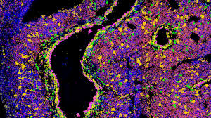

# ALOA (Analysis spatiaL prOfiling imAging)

## Introduction

ALOA is a useful bioinformatics tool for analyzing spatial data and imaging derived from Akoya PhenoimagerTM digital pathology workflow ([Unlock the Power of Spatial Biology with phenoptrReports](https://www.akoyabio.com/wp-content/uploads/2022/01/Spatial-Biology-with-phentoprReports-TechNote.pdf))

## Features
- Spatial **Data** Analysis 📈

    This section provides an overall slide analysis and consists of several steps outlined below.

    The first step is the merge of cell seg data files of each roi. This files are merged into a single file, for each patient and cells that don't have any of the phenotypes of interest (OTHER) are removed. <br>

    The results will be saved into:<br>
    - <em><output_folder>/Merged_clean</em><br>


    From  *Merged_clean* files you can utilize 3 sections:
    - **Map Plot**: this section produces images to visualize spatial distribution of markers of interest
    
 
    - **Description**: this section procudes **bar plots**, through which visualize markers count for each patient, and **box plots** through which compare markers count from groups. <br> For the count there is the possibility to calculate: <br>
            - **RAW** count         <br>
            - **NORMALIZED** count <br>
    - **Distance**: this section calculated the distance from specific markers or from the combination of all the markers of the panel, starting from [phenoptr - Computing inter-cellular distances ](https://akoyabio.github.io/phenoptr/articles/computing_distances.html).<br> From distance data, it's possibile to make statistical analysis from groups, through box plot (default) and distribution curve plot (optional)

- Spatial **Imaging** Analysis 
<br>

    This section provides a data visualization feature that produce static and interactive images from a selected number of ROIs. 

    Firstly ROIs' cell seg data are cleaned from cells that don't have any of the phenotypes of interest (OTHER).

    Subsequently, two different steps can be selected:
 
    - **Image Match**: This section provides a spatial plot of phenotypes' position on ROI's composite image.
    The results will be saved into <em><output_folder>/Img_match</em><br>

    - **Distance Match**: This section provides a spatial plot of phenotypes' distances on ROI's composite image for all possible combination of couples of the selected phenotypes. The results will be saved into <em><output_folder>/Distance_match</em><br>


## Installation


1. Open a terminal
2. Digit the following command to clone the repository folder: 
```
git clone https://github.com/bioinformatics-policlinicogemelli/ALOA
```
3.  Install all of the packages required
```
cd <ALOA_folder_path>/ALOA

pip install -r requirements.txt

Rscript installation_rpackages.R req.txt
```

From Docker

## Usage
The first step to start using ALOA is to correctly set the configuration file *config.json*. This file is divided in 10 subsessions:
<br>
* **Paths**: here is possible to specify *data_input_folder*, *output_folder* and *sample_sheet* paths

* **Packages**: 

* **Phenotypes**: here are specified the markers of interest into *pheno_list*

* **Descriptive**: here is possibile to specify parameters, for descriptive section, as *raw* and/or *normalized* count

* **Map_plot**: here are specified parameters as *multi_plot*, if you can... and *pheno_list* where specified the markers on performing the analysis

* **Distance**: here are specified the parameters for distance calculation as *save_csv* if you want to save the distance values, *save_img* uf you want to... and *pheno_list* if you want to calculate distance between specific markers

* **image_match**:

* **distance_match**:

* **statistical_distance**: here is possibile to specify the markers for which you can perform the distance statsical analysis in *pheno_from* and *pheno_to*

* **cluster**: here is possibile to specify the parameters for clustering analysis as *pheno_list* if you want to specify specific markers, *k* if you want to specify the number of clusters, *cluster_method* to choose the clustering method (spectral or kmeans)

#### Launch ALOA main

These are the options that can be set for this block:

| Options | Input | Type | Required
|----------------|----------------| :---:| :---:|
|-m <br> --merge| <p align="justify">merge datasets from ROIs of the same patient| boolean | No
|-M <br> --maps| <p align="justify">create maps plot| boolean | No
|-d <br> --distance| <p align="justify">distance evaluation between phenotypes| boolean | No
|-s <br> --stats| <p align="justify">create distance stats| boolean | No
|-o <br> --overview| <p align="justify">create data overview | boolean | No
|-C <br> --clustering| <p align="justify">cluster data| boolean | No
|-I <br> --clustering| <p align="justify">create phenotypes image match| boolean | No
|-D <br> --clustering| <p align="justify">create phenotypes distance match| boolean | No
|-w <br> --clustering| <p align="justify">create data overview| boolean | No
