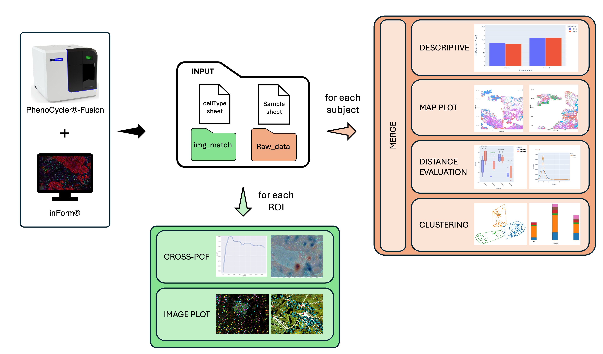

# ALOA (Analysis spatiaL prOfiling imAging)
## Index
- [Introduction](#introduction)
- [Features](#features)
- [Installation and usage](#installation-and-usage)
- [Recomendation](#recommendation)
- [Options](#options)
- [Workflow](#workflow)
- [Usage](#usage)
- [Troubleshooting](#troubleshooting)


## Introduction

ALOA is a useful bioinformatics tool designed to transform raw data from PhenoCycler®-Fusion and inFormTM analysis ([Unlock the Power of Spatial Biology with phenoptrReports](https://www.akoyabio.com/wp-content/uploads/2022/01/Spatial-Biology-with-phentoprReports-TechNote.pdf)) into results suitable for publication, thus advancing the accessibility and utility of spatial tissue analysis in cancer research.

## Features
- Spatial **Data** Analysis 📈

    This section provides an overall slide analysis and consists of several steps outlined below:

    The first step is the merge of cell seg data files of each ROI. These files are merged into a single file for each patient. Cells that don't have any of the phenotypes of interest (OTHER) are removed. <br>

    The results are saved into:<br>
    - <em><output_folder>/Merged_clean</em><br>


    Starting from  *Merged_clean* files it is possible to proceed for 5 different sections:
    - **Map Plots**: this section produces images to visualize spatial distribution of markers of interest.

    - **Description**: this section produces **bar plots** of raw and normalized counts for each patient, and **boxplots** of normalized counts when group comparison is enabled.

    - **Distance**: this section integrates [find_nearest_distance](https://akoyabio.github.io/phenoptr/articles/computing_distances.html) phenoptr script and calculates the distance between two markers.<br> Distances can be compared between groups and visualized through boxplots (default) and distribution curve plots (optional).

    - **Clustering**: this section evaluates different clustering algorithm on data. Markers distribution across clusters can be seen and analyzed through boxplots and reports

    - **CrossPCF**: this section integrates [crossPCF](https://github.com/JABull1066/ExtendedCorrelationFunctions) script from Bull et al, 2024 and calculates the cross-PCF between two markers. <br> Statistical analysis can be conducted if two or more groups are specified.

- Spatial **Imaging** Analysis <br>

    This section offers a data visualization feature that generates both static and interactive images from selected ROIs. 

    Firstly ROIs' cell seg data are cleaned from cells that do not have any of the phenotypes of interest (OTHER).

    Subsequently, 3 different options can be selected:
 
    - **Image Match**: This section provides a spatial plot of phenotypes' position on ROI's composite image.
    
    - **Distance Match**: This section provides a spatial plot of phenotypes' distances on ROI's composite image for all possible combinations of couple of the selected phenotypes.
    
    - **Cross-PCF Image Match**: This section provides a termic plot of Cross-PCF on ROI's composite image for all possible combinations of couple of the selected phenotypes.


## Installation and usage

### Docker (recommended)

#### Requirements:
[Docker ](https://www.docker.com/) with at least 4 CPUs and 6 GB of memory allocated
#### Procedure:

1. Open a terminal
2. Clone the repository folder:
```
git clone https://github.com/bioinformatics-policlinicogemelli/ALOA
```
3. Build docker file
<br> ⚠️ This step can take about 30 minutes to 1 hour depending on the resources allocated to docker 
```
cd <ALOA_folder_path>/ALOA
docker build -t aloa .
```
4. Run ALOA to test the installation
```
docker run -it -v <ALOA_folder_path>/ALOA/data_test:/data_test -v <ALOA_folder_path>/ALOA/output:/output -v <ALOA_folder_path>/ALOA/config.json:/config.json aloa

python3 aloa.py -a 
```


⚠️ for Windows users: some problems with git bash (git for Windows) has been reported. It is recommended to launch the docker command through [Powershell](https://learn.microsoft.com/en-us/powershell/scripting/overview?view=powershell-7.4):
```
docker run -v <ALOA_folder_path>\ALOA\output:/output -v <ALOA_folder_path>\ALOA\data_test:/data_test -it aloa
```


### Local

#### Requirements:

| Name | Minimum <br>Version | Tested <br>Version | 
|----------------|----------------| :---:|
|Python| ≥ 3.10 |  3.10.1
|R| ≥ 4.3 |  4.4.1

⚠️ It's highly recommended to install the tested versions. Other versions may give compatibility problems between libraries.

⚠️ for Windows users, installation [Rtools](https://cran.r-project.org/bin/windows/Rtools/) is also required

#### Procedure:

1. Open a terminal
2. Clone the repository folder:
```
git clone https://github.com/bioinformatics-policlinicogemelli/ALOA
```
3.  Install all of the packages required
```
cd <ALOA_folder_path>/ALOA

pip install -r requirements.txt

Rscript installation_rpackages.R req.txt
```
⚠️ Depending on the operating system it may be necessary to use *pip3* command instead of *pip*

4. Run ALOA to test the installation
```
python3 aloa.py -a
```
⚠️ Depending on the operating system it may be necessary to use *python* command instead of *python3*

## Quick start
 
For docker version run the command below:
```
docker run -it -v <absolute_path_to_input_folder>:/input -v <absolute_path_to_output_folder>:/output -v ./config.json:/config.json aloa
```
where -v docker option is necessary to mount local input and output folders and the user-modified configuration file.
Be aware that if you are using the docker version it is **<u>mandatory</u>** to run this command everytime you are using a new input folder.

⚠️ input and output folders must have the same name in config.json.

i.e. before launch the command below:

```
docker run -it -v /Users/Desktop/project_data:/input -v /Users/Desktop/project_data_output:/output -v ./config.json:/config.json aloa
```
config.json path section must be compiled as follows:
```
"Paths":{
    "data_input_folder":"./input",
    "output_folder":"./output"
}
```
⚠️ It is not necessary that the local output folder (i.e. project_data_output) exists before the starts of the analysis. The folder will be automatically created when aloa.py script is launched.

Run ALOA
```
python3 aloa.py -a
```

## Options

These are the options that can be set by user:

| Options | Input | Type | Required
|----------------|----------------| :---:| :---:|
|-m <br> --merge| <p align="justify">merge datasets from ROIs of the same patient| boolean | Yes*
|-M <br> --maps| <p align="justify">create map plots| boolean | No
|-d <br> --distance| <p align="justify">distance evaluation between phenotypes| boolean | Yes**
|-s <br> --stats| <p align="justify">create distance stats| boolean | No
|-o <br> --overview| <p align="justify">create data overview | boolean | No
|-c <br> --clustering| <p align="justify">cluster data| boolean | No
|-p <br> --pcf| <p align="justify">pcf analyses| boolean | No
|-I <br> --imgMatch| <p align="justify">create phenotypes image match| boolean | No
|-D <br> --dstMatch| <p align="justify">create phenotypes distance match| boolean | No
|-a <br> --all| <p align="justify">run all the analysis| boolean | No
|-f <br> --force| <p align="justify">force the start of the analysis| boolean | No

*only for whole slide analysis (**NOT** required for pcf, imgMatch and dstMatch)
** -d is mandatory if -s option is set

⚠️ If an already existing output folder is found, ALOA will exit with error.

⚠️ force option allow user to overcome some code restrictions as the one mentioned above or the required options to run specific analysis. This option may give problems if previous steps have failed or are incomplete...**use it carefully!**

## Workflow

<br>
<p align="center"></p>


## Usage

Before running ALOA, please set correctly the configuration file *config.json*.

```
{
   "Paths":{
      "data_input_folder":"<path_to_input_folder>",
      "output_folder":"<path_to_output_folder>"
   },
   "Phenotypes":{
      "pheno_list":[
         "<Phenotype1>",
         "<Phenotype2>",
         "<Phenotype1,Phenotype3+>"
      ]
   },
   "Descriptive":{
      "raw": [true, false],
      "normalized": [true, false]
   },
   "Map_plot":{
      "multi_plot":[true, false],
      "pheno_list":[
      	 "<Phenotype1>",
         "<Phenotype2>",
         "<Phenotype1,Phenotype3+>"
      ]
   },
   "Distance":{
      "save_csv":[true, false],
      "save_img":[true, false],
      "pheno_list":[
      	 "<Phenotype1>",
         "<Phenotype2>",
         "<Phenotype1,Phenotype3+>"
      ],
      "pheno_from":"",
      "pheno_to":"",
      "plot_distance":[true, false],
      "save_csv_zetascore":[true, false]
   },
   "Image_match":{
      "pheno_list":[
         "<Phenotype1>",
         "<Phenotype2>",
         "<Phenotype1,Phenotype3+>"
      ],
      "interactive":[true, false],
      "layout_marker_edge_col":"black",
      "layout_marker_size":10,
      "layout_xsize":1200,
      "layout_ysize":900
   },
   "Distance_match":{
      "pheno_list":[
         "<Phenotype1>",
         "<Phenotype2>",
         "<Phenotype1,Phenotype3+>"
      ]
   },
   "Cluster":{
      "pheno_list":[
         "<Phenotype1>",
         "<Phenotype2>",
         "<Phenotype1,Phenotype3+>",
         "verbose":"" ["", 1, 2, 3]
      ],
      "algo_method":"e",
      "k":10,
      "cluster_method":"ksp"
   },
   "Cross_pcf":{
      "pheno_list":[
         "<Phenotype1>",
         "<Phenotype2>",
         "<Phenotype1,Phenotype3+>"
      ],
      "radiusOfInterest":50,
      "all_pcf":false, 
      "maxR":150,
      "annulusStep":10,
      "annulusWidth":10,
      "on_roi":false
   },
   "Stats":{
      "sample_type":["", "paired", "unpaired"],
      "p_adj":["bonferroni", "sidak", "holm-sidak", "benjamini-hochberg"]
   }
}
```

* **Paths**: specify the location of input and output data. <br> ⚠️ For Windows users, <u>in case of local installation</u>, path must be written with "\\\\" (i.e. "C:\\\\Users\\\\input_data)

* **Phenotypes**: specify the markers of interest into *pheno_list*. Only the markers specified will be considered for the analysis. <br>⚠️ Inside *pheno_list* it is possible to select single phenotype ("PANCK+", "IBA1+") or multipositivity markers separeted with comma ("PANCK+,BIRC5+", "PANCK+,AURKA+,BIRC5+,MYB-B+"). <br>⚠️ Phenotype must always have "+" at the end (❌ PANCK;  ❌ PANCK+,BIRC5; ❌ PANCK,BIRC5; ✅ PANCK+;  ✅ PANCK+,BIRC5+)!

* **Descriptive**: True/False. Specify if barplots will be generated with *raw* and/or *normalized* counts and, when possible, apply statistical comparison.

* **Map_plots**: specify the markers to plot by *pheno_list* (if not specified the complete list of phenotypes will be considered).

* **Distance**: True/False to save distances on csv and/or images,  specify markers in *pheno_list* (if not specified the complete list of phenotypes will be considered) to calculate distance between specific markers, *pheno_from* and *pheno_to* to set specific couple of markers and distance direction, *plot_distance* to save distance curves and *save_csv_zscores* to save z-score distances.

* **Image_match**: specify a sublist of markers to print on composite images (if not specified the complete list of phenotypes will be considered) via *pheno_list*. It is also possible to create interactive images, in addition to the static ones, by setting *interactive* option as true. Interactive graphs' layout can also be customized with the options *layout_marker_edge_col* and *layout_marker_size* to change respectively the edge color and the size of dots plotted on image and *layout_xsize* *layout_ysize* to customize the size of the image.

* **Distance_match**: specify a sublist of markers whose distances is printed on composite images via *pheno_list* (if not specified the complete list of phenotypes will be considered).

* **statistical_distance**: specify the markers for which you want perform the distance statsical analysis in *pheno_from* and *pheno_to*

* **Cluster**: specify the parameters for clustering analysis as *pheno_list* if you want to specify a restricted list of markers. In config.json, under  *algo_method* section you can chosse between two algorithms for the selection of k optimal: silouhette score *s* or elbow method *e* (i.e. to use elbow method -> "algo_method":"e").
*  *k* is the maximum number of clusters (default k=10). Users can choose between three clustering algorithms: k-means *k*, spectral *s* and prototype k-means *p*. The setting can be done by adding in *cluster_method* a string with the cluster algorythms of interest (i.e. to use k-means and spectral -> "cluster_method":"ks"). <br> ⚠️ The ideal pairing for silhouette analysis is spectral clustering, for prototype analysis it's elbow method, and k-means is suitable for both. <br> ⚠️ Spectral clustering algorithm it is not recommended for large datasets (~ O(n³) time complexity and O(N²) space complexity).

* **Cross_pcf**: specify the parameters for cross-PCF analysis as *radiiusOfInterest*, *anulusStep* and *anulusWidth* (for more info about this parameters check [Cross-PCF](https://www.cambridge.org/core/journals/biological-imaging/article/extended-correlation-functions-for-spatial-analysis-of-multiplex-imaging-data/FB677F0E100658E36725C5B4A3944EB7)). It is also possible to specify a restricted list of markers through *pheno_list*, to plot a single image with all pcfs with *all_pcf* or to plot TCM maps on ROIs settign *on_roi*

* **Stats**: here is possible to set parameters for statistical analysis like *sample_type* to define if the group is paired or unpaired (Default:"unpaired") and *p_adj* to set a p-value correction method between Bonferroni, Sidak, Holm-Sidak, Benjamini-Hochberg (Default:Bonferroni).

### Input Folder Structure

The input folder for ALOA tool must be organized as follows:

```
input
├── img_match
│   ├── sbj001_[14146,53503]_composite_image.jpg
│   ├── ... 
│   └── sbjN_[13394,50883]_composite_image.jpg
│
├── raw_data
│   ├── sbj001
│   │   ├── sbj001_[14146,53503]_cell_seg_data.txt
│   │   ├── ...
│   │   └── sbj001_[17241,54367]_cell_seg_data.txt
│   ├── ...
│   └── sbjN
│       ├── sbjN_[13394,50883]_cell_seg_data.txt
│       ├── ...
│       └── sbjNT_[17130,56449]_cell_seg_data.txt
│
├── cellType_dict.tsv
└── sample_sheet.tsv

```
Where input is the main folder containing:
* raw_data: this folder contains as many subfolders as the number of subjects analyzed. Each subject folder contains the segmentation data for each ROI. <br>⚠️ This folder is required when -I and -D options are selected!
* img_match: this folder contains the ROIs on which plot markers and distances are computed
* sample_sheet.tsv: this file must be compiled by the user with the subjects IDs and the belonging group. Its structure is shown below:

    | sbj_ID | Group|
    |----------------|----------------|
    |sbj001| Group1|
    |sbj002| Group1|
    |...| ...|
    |sbjN| GroupX|
* cellType.tsv: this file must be compiled by the user with cell type name corresponding to each marker of interest. <br>⚠️ This file is required when -p option is selected!

    | Phenotype | Cell_Type|
    |----------------|----------------|
    |FoxP3+| Regulatory T cell|
    |...| ...|
    |CD68+| Cytotoxic T cell|

### Output Folder Structure

All ALOA results are saved into a folder output whose path is specified in *config.json* file. The output folder is organized as follow:
```
output
├── Merged
├── Merged_clean
├── Map_plots
├── Descriptive
├── Distance
├── Distance_Statistical
├── Clustering
├── Cross_PCF
├── Distance_match
├── Img_match
└── Log
```
All log files are saved into Log folder. The other output subfolders are named as the corresponding analysis and will be explained below.

### 1. Merged
In this output folder, all cell_seg_data.txt files for each patient are merged into a single file through the integration of phenoptr [merge](https://akoyabio.github.io/phenoptrReports/articles/consolidation.html) function.

Two files are genetared:
- files where **negative cellulas** for markers of interest haven't been deleted (saved into *Merged* folder)
- files where **negative cellulas** for  markers of interest have been deleted (saved into *Merged_clean* folder)

Into *Merged* and *Merged_clean* will be created as many sub-folders as the number of groups. These subfolders will contain merged files for each patient of each group. Each merged file will be named as *patientnames.txt*

```
Merged
├── Group1
│   ├── Merge_cell_seg_data_sbj001.txt
│   ├── ...
│   └── Merge_cell_seg_data_sbjN.txt
├── ...
└── GroupN
    └── ...
Merged_clean
├── Group1
│   ├── Merge_cell_seg_data_clean_sbj001.txt
│   ├── ...
│   └── Merge_cell_seg_data_clean_sbjN.txt
├── ...
└── GroupN
    └── ...
```

ALOA command to generate this output:
```
python3 aloa.py -m
```

### 2. Map Plots
In this section a plot of all markers of interest will be generated for each patient.

```
Maps_plot
├── Group1
│   ├── sbj001_Pheno_CD68+CD8+FoxP3+CK+.pdf
│   ├── ...
│   └── sbjN_Pheno_CD68+CD8+FoxP3+CK+.pdf
└── GroupN
    └── ...
```
ALOA command to generate this output:
```
python3 aloa.py -m -M
```

### 3. Descriptive
This folder output contains barplots of raw and/or normalized markers counts for each patient and for each group. Merged files generated from previous section are the input files of this section. Counts are saved into csv files (*csv* folder) and visualized through **barplot** figures saved into *Barplot* folder.

⚠️ Two different formulas are used for count normalization in barplots (*Norm_count_patientname.csv*) and in boxplots (*all_norm_count_patientsname*). For more details see [functions ](./functions.md) section.


When two or more groups are listed, a statistical comparison on marker counts is made to seek for significance difference between groups. Statistics is computed on raw and normalized counts. Results, saved into *Box_Plot* folder, are shown on **box plot** figures and statistical annotation is made through [TAP ](https://github.com/Discovery-Circle/tap) library.

```
Descriptive
├── Box Plots
│   ├── box_plot_comparison_Normalized.jpeg
│   └── box_plot_comparison_Raw.jpeg
├── Group1
│   ├── Bar_plot
│   │   ├── Bar_Plot_Normalized.jpeg
│   │   └── Bar_Plot_Raw.jpeg
│   └── csv
│       ├── Norm_count_sbj001.csv
│       ├── ...
│       ├── Raw_count_sbj001.csv
│       └── ...
├── ...
└── GroupN
    └── ...
            
```
ALOA command to generate this output:

```
python3 aloa.py -m -o
```
### 4. Distance

Distances between markers are evaluated through phenoptr [distance](https://akoyabio.github.io/phenoptr/articles/computing_distances.html) function.

```
Distance
├── Group1
│   ├── sbj001_Distance.txt
│   ├── ...
│   └── sbjN_Distance.txt
├── ...
└── GroupN
    └── ...
```
ALOA command to generate this output:

```
python3 aloa.py -m -d
```
A statistical analysis can be also performed if two or more groups are reported and *Distance_Statistical* folder is created to save all statistical results.

⚠️ Distance values are calculated as Z-score. For more details see For more details see [functions](./functions.md)


The results are: 
- **boxplot** figures, with statistical annotation made with [TAP ](https://github.com/Discovery-Circle/tap) library.
- **csv** file with distance values for all patients for each group.
- **distance_curve** figures (optional), saved into distance_curve folder, where are plotted the distributions of the distances of comparative groups for a specific couple of markers.

```
Distance_Statistical
    ├── box_plot
    │   ├── distances_box_plot_CD68+_to_CD8+.png
    │   │   ...
    │   └── distances_box_plot_FoxP3+_to_CK+.png
    ├── csv
    │   ├── df_statistical_distance_CD68+_to_CD8+.csv
    │   │    ...
    │   └── df_statistical_distance_FoxP3+_to_CK+.csv
    ├── distance_curve
    │   ├── plot_statistical_distance_CD68+_to_CD8+.png
    │   │    ...
    │   └── plot_statistical_distance_FoxP3+_to_CK+.png
    └── summary_statistical.csv

```
ALOA command to generate this output:
```
python3 aloa.py -m -d -s
```

### 5. Clustering

The output folder will be organized for each group as:
- **k optimal** folder containing all curves' images made by the k optimal chosen method
- **cluster algorithm** folder containing *percentage* subfolder with all markers' percentage in each cluster, *scatter_plot* containing a scatterplot for each subject and *stacked_barplot* for each analyzed subject.
```
Clustering
├── Group1
│   ├── elbow_scores/silouhette_scores
│   │   │   ├── sbj001_[14146,53503].tiff
│   │   │   ├── ...
│   │   │   └── sbjN_[13394,50883].tiff
│   ├── kmeans
│   │   ├── percentage
│   │   │   ├── cluster_percentage_sbj001_[14146,53503].csv
│   │   │   ├── ...
│   │   │   └── cluster_percentage_sbjN_[13394,50883].csv
│   │   ├── scatter_plot
│   │   │   ├── sbj001_[14146,53503].tiff
│   │   │   ├── ...
│   │   │   └── sbjN__[13394,50883].tiff
│   │   └── stacked_barplot
│   │       ├── sbj001_[14146,53503].tiff
│   │       ├── ...
│   │       └── sbjN__[13394,50883].tiff
│   ├── prototype
│   │   ├── percentage
│   │   │   └── ...
│   │   ├── scatter_plot
│   │   │   └── ...
│   │   └── stacked_barplot
│   │       └── ...
│   └── spectral
│       ├── percentage
│       │   └── ...
│       ├── scatter_plot
│       │   └── ...
│       └── stacked_barplot
│           └── ...
├── ...
└── GroupN
    └── ...
```
ALOA command to generate this output:
```
python3 aloa.py -m -c
```

### 6. Cross-PCF
Cross-PCF is implemented by the integration of J. Bull cross-PCF [scripts](https://github.com/JABull1066/ExtendedCorrelationFunctions). For each group, a subfolder named as the subject ID is created and structured as follows:
- **Celltype couple** folder containing three images: cross-pcf curve, topographical map, and point cloud plot. Those three images are generated for each ROI and radius chosen by the user.  When "on_roi" parameter is set to "True", topographical map is plotted on ROI and an extra image "TCM_on_ROI.tif" is generated.
- **summary** folder containing the csv files with all the cross-pcf values for each couple of celltypes.

If two or more groups are present, also a statistical analysis between cross-PCFs are evaluated and saved in **stats** folder for each radious.

```
Cross_PCF
├── Group1
│   ├── sbj001
│   │   ├── Macrophages-Cytotoxic_T_cell
│   │   │   ├── ROI_14146,53503
│   │   │   │   └── r_50
│   │   │   │       ├── PCF_function.tif
│   │   │   │       ├── TCM.tif
│   │   │   │       ├── TCM_on_ROI.tif
│   │   │   │       └── point_cloud.tif
│   │   │   ├── ...
│   │   │   └── Regulatory_T_cell-Cytotoxic_T_cell
│   │   │       └── ...
│   ├── ...
│   │   └── ...
│   ├── ...
│   └── summary
│       ├── Macrophages-Cytotoxic_T_cell.tsv
│       ├── ...
│       └── Regulatory_T_cell-Macrophages.tsv
│
├── ...
├── GroupN
│   └── ...
└── stats
    └── stat_analysis_r_50.tsv
```
ALOA command to generate this output:
```
python3 aloa.py -p
```
### 7. Imaging
The markers' position and their distances can be plot on single chosen ROI image.
In particular, for marker positions the output folder will be structured as:
- **tif** images with markers plotted on ROIs
- **Interactive_plots** folder containing the same images mentioned above with the possibility to select and show only specific markers by clicking on the correspondive legend dot.
```
Img_match
├── Interactive_plots
│   ├── sbj001_[14146,53503]_composite_image_match_CD68+CD8+FoxP3+CK+.html
│   │   ...
│   └── sbjN_[13394,50883]_composite_image_match_CD68+CD8+FoxP3+CK+.html
│
├── sbj001_[14146,53503]_composite_image_match_CD68+CD8+FoxP3+CK+.tif
│   ...
└── sbjN_[13394,50883]_composite_image_match_CD68+CD8+FoxP3+CK+.tif
```
ALOA command to generate this output:
```
python3 aloa.py -I
```
For distances plot a tiff image of the distances on ROI will be create for each couple of markers.
```
Distance_match
├── sbj001_[14146,53503]_composite_image_dist_match_CD68+CD8+_Nearest_CD68+_to_each_CD8+.tif
├── ...
└── sbjN_[13394,50883]_composite_image_dist_match_FoxP3+CK+_Nearest_FoxP3+_to_each_CK+.tif
```
ALOA command to generate this output:
```
python3 aloa.py -D
```
## Troubleshooting

This page lists solutions to problems you might encounter using ALOA.

- ALOA returns **KILLED** when using Docker version. Please increase Docker memory to at least 6 GB and Docker CPUs to at least 4.
  To do so: open Docker app, go to Settings (engine icon on the upper-right panel), go to Resources, increase CPUs and Memory. Apply & restart.


