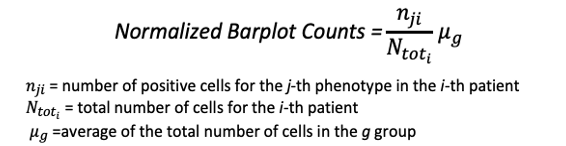
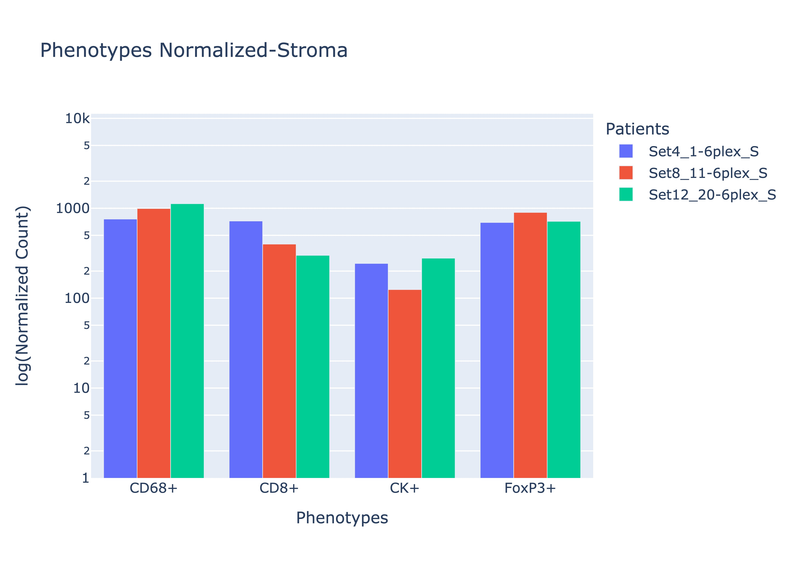
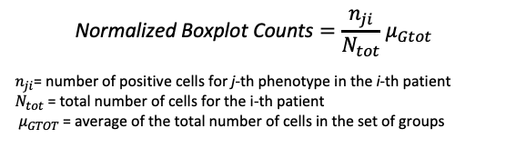
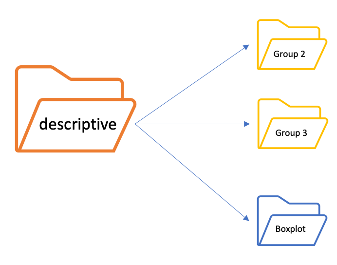
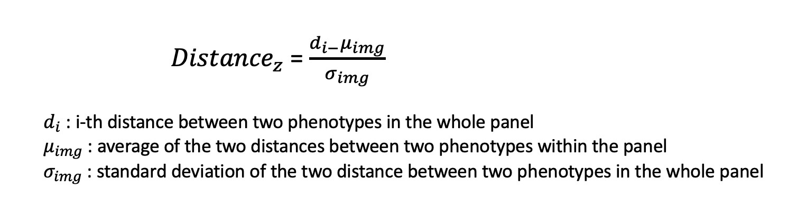
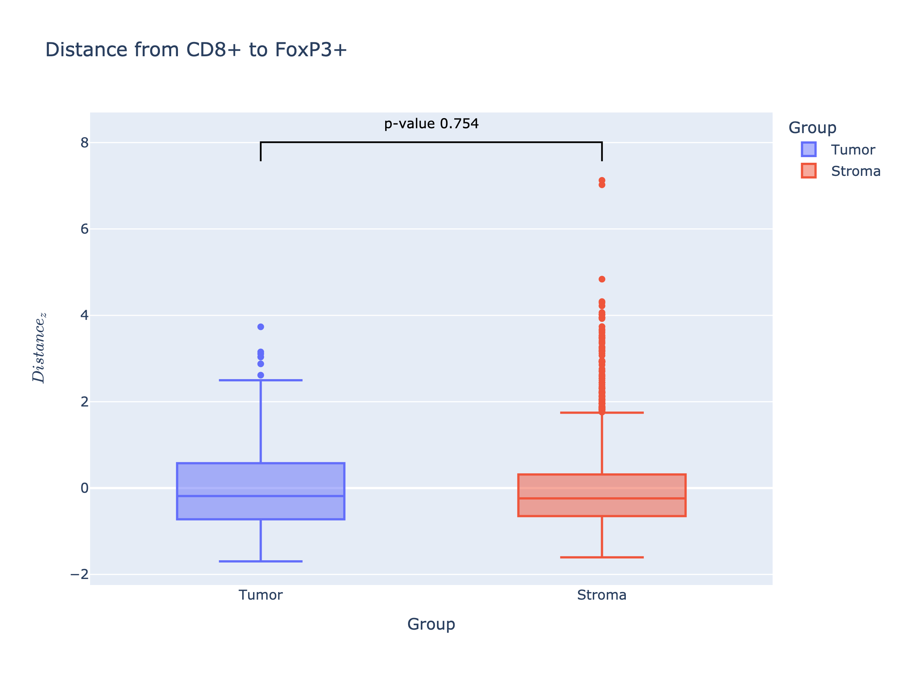
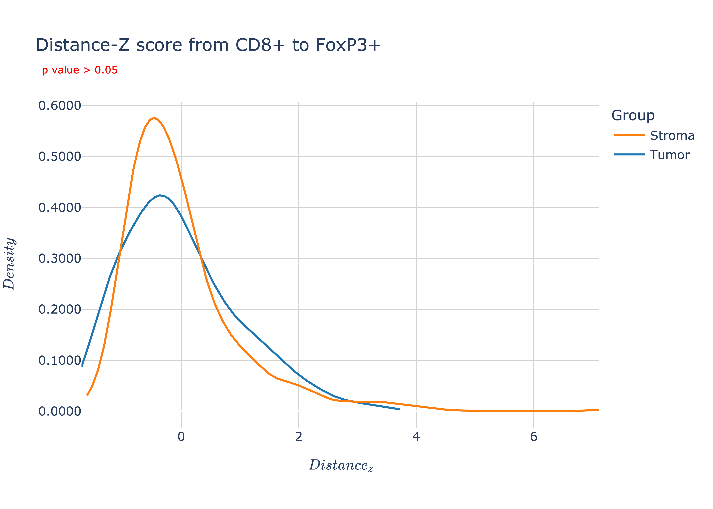

## In-depth functions
- **function_descriptive_analysis.py**

    The ```function_descriptive_analysis``` is a Python script that allows you to make a phenotype description from the Merged_clean file and a statistical comparison if there are more than one group.<br>
    Through this function a parent folder is created, **descriptive**, containing just as many subfolders as there are groups present.<br>
    **Example**:<br> if we have 2 groups ("Group 2" and "Group 3")

  <p align="center"></p>

    <br>
    <br>
    Through this function you can:

    - Calculated the raw counts of the phenotypes for each patient for each group,saved as *"Raw_count_patientID.csv"* into **csv** folder

    - Calculated the normalized counts of the phenotypes for each patient for each group (view formula), saved as *"Norm_count_patientID.csv"* into **csv** folder <br>
    <br>
    <p align="center"></p>

    <br>
    Starting from this counts, a barplot is created to visualize the distribution of the phenotypes for each patient into a single group, saved the image into **Bar_plot** folder.

 
    <p align="center"></p>

    If there are **more than one group**, this function makes a comparison between the group for the phenotypes of interest. <br>
    For the comparison are utilized count normalized for all the groups present as formula <br>

   <p align="center"> </p>

    Box plot are created for raw and/or normalized count and saved into Box Plot folder.<br>
    <br>
    <p align="center"></p>
    <br><br>
    

    Statistical test is: <br>
    - **Mann-Whitney** test if there are 2 groups <br>
    - **Kruskal** test if there are more than 2 groups

    
    <p align="center"></p>

<br><br>

- **function_statistical_distance.py**<br>
The ```function_statistical_distance``` is a Python script to make statistical analysis on distance results.
Starting from distance files, generated for each patient for each group, the function can make:
    - comparison between 2 specific markers insert into config file 
    <br>
    **Example:** <br>
    if we are interested in performing statistical analysis on the distance from marker **X** to marker **Y**, the config file will be
    

   ```
    "statistical_distance":{

      "pheno_from":"X",

      "pheno_to":"Y"
   }
    ```
    <br><p align="center">**or**</p><br>
    - comparison between all the permutation of the markers insert into **pheno_list** of config file , if there aren't markers "from" and "to" specify <br>
    **Example:** <br> No specific marker from and to, the config file will be <br>
    ```
    "statistical_distance":{

      "pheno_from":"",

      "pheno_to":""
   }
    ```
    For the comparison the distance values are standardized (Z-score) as in formula:
    <p align="center"> </p>


    A parent folder is created, **Distance_statistical**, containing one or 3 folders as in figure.
    <br>

    <p align="center"> </p>

    Through this function you can:

    - Created boxplot to compare distances between the groups present, saved into box_plot folder 
    <br>**Example**</br>
    <p align="center"></p>
    
    On box plot is add the statistical annotation and statistical test are:<br>
      - **Mann-Whitney**, if there are 2 groups<br>
      - **Kruskal**, if there are more than 2 groups


    - Created curve plot to visualize the distribution of group distance (optional), saved into distance_curve folder 
    <br>**Example**
    <p align="center"></p>

    - Created csv file (optional) with zeta score value for the **from**-**to** markers selected, saved into csv folder

    - Created a csv file *"summary_statistical_csv"* to summurize the informartion of the analysis, saved into Distance_Statistical folder. Among the daved information there is also the group for which the distance beteween markers analyzed is greatest, ased on the median of the group's zeta-score.
    <br>The header of this file, if there are 2 groups, is:<br>
      ```
      Phenotype	 Distance_to	P_value	 Meadian_Grade_II	 Meadian_Grade_III	Group_major
      ```

   