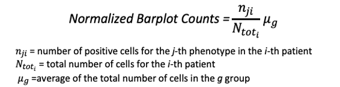
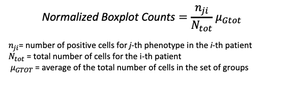
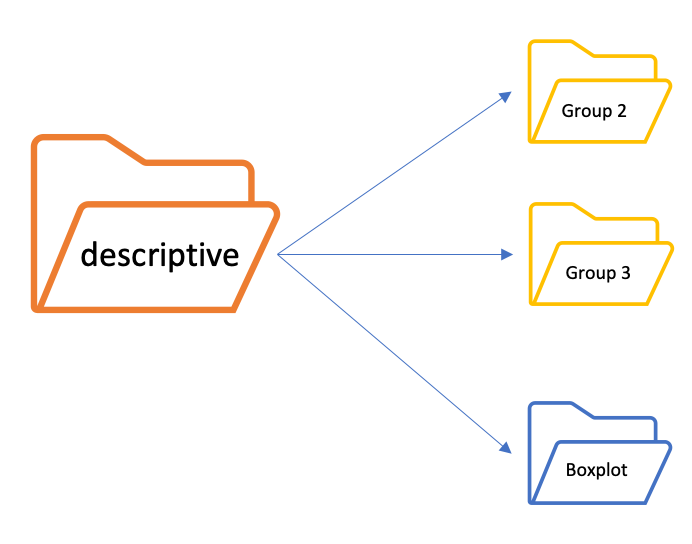

## In-depth functions
- **function_descriptive_analysis.py**

    The function_descriptive_analysis function is a Python script that allows you to make a phenotype description from the Merged_clean or Merged file and a statistical comparson if there are more than one group. 
    Through this function a parent folder is created, **descriptive**, containing just as many subfolders as there are groups present. 
    **Example**:  if we have 2 groups ("Group 2" and "Group 3")

    

     
     
    Through this function you can:

    - Calculated the raw counts of the phenotypes for each patient for each group,saved as *"Raw_count_patientID.csv"* into **csv** folder

    - Calculated the normalized counts of the phenotypes for each patient for each group (view formula), saved as *"Norm_count_patientID.csv"* into **csv** folder  
     
    

     
    Starting from this counts, a barplot is created to visualize the distribution of the phenotypes for each patient into a single group, saved the image into **Bar_plot** folder.

    **++INSERIRE IMMAGINE DI ESEMPIO DI UN BARPLOT++**

    If there are **more than one group**, this function makes a comparison between the group for the phenotypes of interest.  
    For the comparison are utilized count normalized for all the groups present as formula  

    

    Box plot are created for raw and/or normalized count and saved into Box Plot folder. 
     
    

  
    

    Statistical test is:  
    - **Mann-Whitney** test if there are 2 groups  
    - **Kruskal** test if there are more than 2 groups

    **+++INSERIRE IMMAGINE DI ESEMPIO DI UN BOXPLOT+++**

    

   